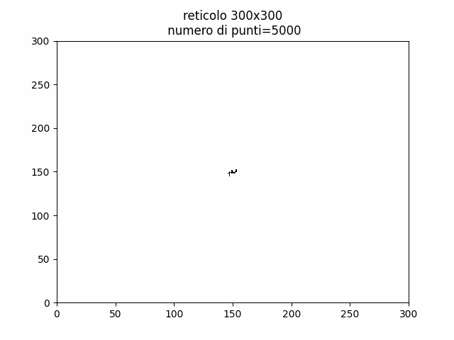

# dielectric_breakdown
simulazioni di rottura dielettrica (tesi di laurea in Fisica)

#laplace 
risolve iterativamente l'equazione di Laplace su reticolo nxn per condizioni al bordo di Dirichlet arbitrarie

#breakdown 
simula su reticolo la crescita di curve di rottura dielettrica (DBM model)

#hausdorff
stima tramite fit logaritmico la dimensione frattale di curve su reticolo 

#db.f
Versione in fortran della medesima simulazione, con aggiunta della possibilità di creare un'animazione

#plotdb.py
File python per i plot delle simulazioni del codice fortran

